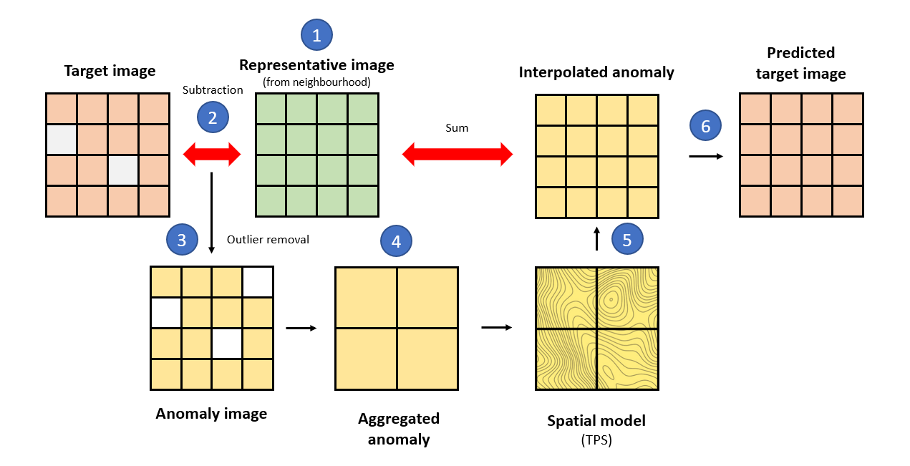

```{r, include = FALSE}
knitr::opts_chunk$set(
  eval = FALSE,
  collapse = TRUE,
  comment = "#>"
)
```

# Processing

Processing encapsulates the operations applied to satellite images to solve particular issues derived from errors, anomalies or discrepancies from sensors. For instance, cloud removal or sensor failures can lead to data gaps in time-series of satellite images. Additionally, noise from aerosols, dust, and sensor measurement errors can reduce the quality of the remotely sensed data. The ***Interpolation of Mean Anomalies (IMA***) is a gap-filling and smoothing approach that mitigates these issues [@ima2019].

### Filling missing data {#filling}

#### Theoretical background

`rsat` implements a generic version of the algorithm with the function `smoothing_image()`.

{width="456"}

For the theoretical explanation, let's assume that $15$ images are available in the dataset (squares in the image above). The imagery corresponds to $5$ consecutive days over $3$ years. Consider that we are willing to fill/smooth the target image (red square). *IMA* fills the gaps borrowing information from an *adaptable* temporal neighborhood (yellow squares). Two parameters determine the size of the neighborhood; the number of days before and after the target image (`nDays`) and the number of previous and subsequent years (`nYears`). Both parameters should be adjusted based on the temporal resolution of the of the time-series of images. We recommend that the neighborhood extends over days rather than years, when there is little resemblance between seasons. Also, cloudy series may require larger neighborhoods.



*IMA* gives the following steps; (1) creates a representative image of the neighborhood ignoring missing values e.g., doing the mean, median, etc. for each pixel's time-series (`fun`), (2) the target and representative images are subtracted giving an image of *anomalies*, (3) the *anomalies* falling outside the quantile limits (`aFilter`) are considered outliers and therefore removed, (4) it aggregates the anomaly image into a coarser resolution (`fact`) to reveal potential spatial dependencies, (5) the procedure fits a spatial model (thin plate splines or *TPS*) to the anomalies which is then used to interpolate the values at the original resolution, and (6) the output is the sum of the interpolated anomalies and the average image. The process is encapsulated in `smoothing_image()` and the section below shows its usage.

------------------------------------------------------------------------

#### Hands-on demonstration

##### Data

The showcase uses a time-series of $6$ *NDVI* images. *NDVI* stands for *Normalized Difference Vegetation Index* and it is an indicator of vegetation's vigor. Values close to $1$ indicate the presence of green and dense vegetation. Images correspond to a region in norther Spain between August $2^{nd}$ and $4^{th}$, in $2017$ and $2018$. The images are part of the package and can be loaded into the environment as follows:

```{r advanced_ima_data}
library(rsat)
data("ex.ndvi.navarre")
```

Let's display the series of images to spot the gaps of data:

```{r advanced_ima_show}
library(tmap)
tm_shape(ex.ndvi.navarre) + tm_raster(title = "NDVI", style = "cont")
```

The maps show a hole on August $3^{rd}$, $2017$ in the upper part of the image. The aim of *IMA* is to predict the values of the missing parts to provide a complete and continuous dataset.

##### Interpolation of Mean Anomalies

The instruction below applies the *IMA* to the entire series. It uses a temporal neighborhood of $2$ days and $1$ year and the representative image is the `mean`. Outliers are the anomalies outside $1-99$ quantile range. Anomalies are aggregated at a factor of $10$ (every $10$ pixels are aggregated into $1$) to fit an approximate spatial model. We recommend to tune the parameters accordingly to obtain the best performance possible in each situation:

```{r advanced_ima}
library(rsat)
ndvi.fill <- rsat_smoothing_images(method = "IMA",
                                   ex.ndvi.navarre,
                                   nDays = 2,
                                   nYears = 1,
                                   fun = mean,
                                   aFilter = c(0.01,0.99),
                                   fact = 10,
                                   only.na = TRUE)
```

The algorithm predicts the value for the missing and the existing pixels. The last argument, `only.na = TRUE`, indicates that the results should preserve the original values wherever available. *IMA* is able to run when neighborhoods are incomplete. In those situations, the algorithm simply uses the imagery available within the temporal neighborhood. The function prints a message specifying the actual number of images being used in each case.

Let's make a comparison between *before* and *after* the application of *IMA.*

```{r advanced_ima_result}
before <- ex.ndvi.navarre[[1:3]]
after <- ndvi.fill[[1:3]]
tm_shape(stack(before,after)) + tm_raster(title = "NDVI", style = "cont")
```

The intention is to keep growing the number of algorithms devoted to processing in future versions of the package.
